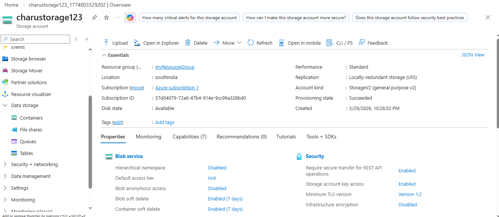
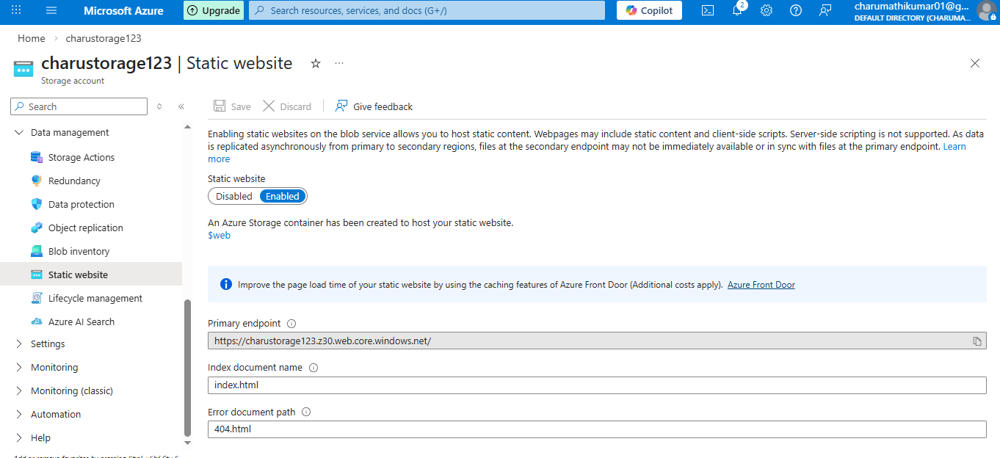
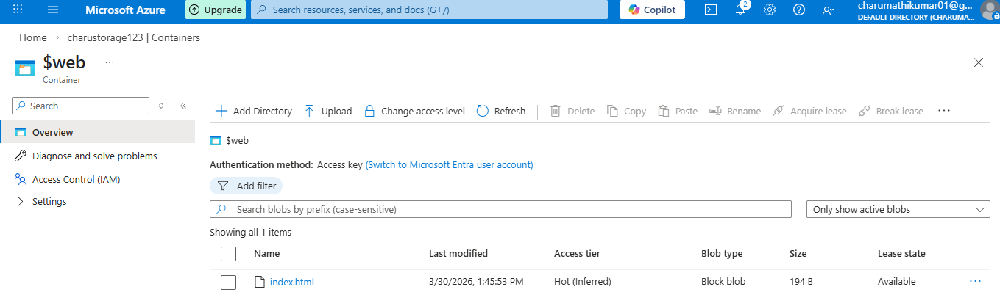

# Azure-Storage-Static-Website-Project

## Project Overview

This project demonstrates hosting a static website using Azure Storage Account and Blob Container

## Azure Services Used

Azure Storage Account
Blob Container
Static Website

## Step Performed

1. Created Storage Account
2. Enabled Static Website
3. Uploaded index.html to $web container
4. Accessed website using Primary Endpoint

## Project Screenshot

## Storage Account Overview

## Enabled Static Website 

## $web Container inside Container

## index.html File Inside Container

## Website Running

## Outcome

Static website successfully hosted using Azure

## Author

Charumathi

